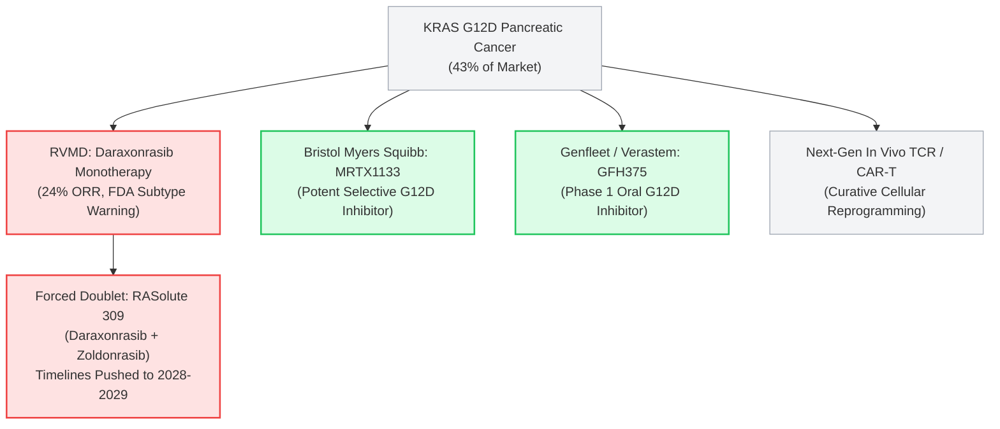

On October 8, 2026, the polished investment thesis propelling **Revolution Medicines (NASDAQ: RVMD)** to an eye-watering **$40 billion market capitalization** suffered a catastrophic reality check.

Following the late August 2026 accelerated approval of its lead multi-RAS(ON) inhibitor **Rasonque (daraxonrasib / RMC-6236)** for previously treated metastatic pancreatic ductal adenocarcinoma (PDAC), the U.S. Food and Drug Administration (FDA) released its unredacted [Medical and Statistical Review documents](https://www.fda.gov/drugs).

The regulatory review contained a bombshell that the company's promotional press releases had conveniently smoothed over: daraxonrasib's celebrated efficacy is riddled with severe biological disparities across KRAS mutation subtypes. Most critically, in **KRAS G12D**—the dominant mutation found in **43% of all pancreatic cancer patients**—Rasonque produced an objective response rate (ORR) of a paltry **24%**, compared to **50%** in the smaller G12V cohort.

The stock plummeted over 6.36% intraday, breaking down toward $180:


As retail investors and hedge funds scrambled to decipher the FDA's clinical critique, biotechnology journalist **Adam Feuerstein** and forensic financial account **Shitbox Tracker** captured the absurd cognitive dissonance dominating Wall Street:


> *"Sell siders furiously defending $RVMD today like someone called their moms ugly."*  
> — **Adam Feuerstein (@adamfeuerstein), October 8, 2026**

> *"20 analysts. 20 buys.*  
> *insiders: $149.7M sold. zero bought. 12 months.*  
> *stock -6.36% today. G12D response rate: 24%.*  
> *the sell side and the Form 4s are having two completely different conversations."*  
> — **Shitbox Tracker (@shitboxtracker), October 8, 2026**

This report conducts a forensic, institutional deep dive into Revolution Medicines. We dissect the biophysics behind the G12D failure, audit the relentless C-suite insider dumping, evaluate the company’s alarming **$2.1B+ annual cash burn rate**, and explain why RVMD represents one of the most asymmetric **SELL / SHORT** setups in large-cap biotechnology today.

---

```
┌──────────────────────────────────────────────────────────────────────────────────────────────────┐
│                 REVOLUTION MEDICINES ($RVMD): THE ANATOMY OF A $40B BIOTECH TRAP                 │
├──────────────────────────────────┬───────────────────────────────────────────────────────────────┤
│ METRIC                           │ INSTITUTIONAL AUDIT & REALITY CHECK                           │
├──────────────────────────────────┼───────────────────────────────────────────────────────────────┤
│ Market Capitalization            │ ~$39.5B – $42.8B (Priced for universal commercial dominance)   │
│ 2026 Projected GAAP OpEx         │ $2.1B – $2.2B ($525M – $550M cash incinerated every quarter)  │
│ Balance Sheet Cash (Q2 2026)     │ $3.9B (Bolstered by $2.1B April equity dilution)              │
│ Operational Runway               │ < 22 Months at current burn rate without further dilution     │
│ Wall Street Analyst Consensus    │ 20 BUYS / 0 HOLDS / 0 SELLS (100% Unanimous Buy)              │
│ Trailing 12-Month Insider Trades │ $149.7M SOLD / $0.00 BOUGHT (C-Suite cash-out)                │
│ Rasonque G12V Response Rate      │ 50% ORR (~30% of pancreatic cancer patients)                 │
│ Rasonque G12D Response Rate      │ 24% ORR (43% of pancreatic cancer patients; bare chemo delta) │
│ Management Damage Control        │ Rushed launch of RASolute 309 doublet on Oct 5 (concession)   │
│ Institutional Verdict            │ STRONG SELL / SHORT (Fair Value: $90 – $110 / share, -45-55%) │
└──────────────────────────────────┴───────────────────────────────────────────────────────────────┘
```

---

## 1. The Biological Smoking Gun: The G12D Achilles' Heel

To understand why the market’s reaction to the FDA review is not a "transitory dip" but an existential threat to RVMD's valuation, one must examine the molecular pathology of [pancreatic ductal adenocarcinoma](https://www.cancer.gov/types/pancreatic).

Pancreatic cancer is notoriously aggressive, with KRAS driver mutations present in more than 90% of cases. However, KRAS is not a monolithic target. In PDAC, the mutation distribution is heavily skewed:

```
┌──────────────────────────────────────────────────────────────────────────────────────────────────┐
│                   KRAS MUTATION FREQUENCY IN PANCREATIC DUCTAL ADENOCARCINOMA                    │
├──────────────────────┬──────────────────────┬────────────────────────────────────────────────────┤
│ SUBTYPE              │ PREVALENCE           │ CLINICAL PERFORMANCE OF DARAXONRASIB (FDA REVIEW)  │
├──────────────────────┼──────────────────────┼────────────────────────────────────────────────────┤
│ KRAS G12D            │ ~43% (Dominant)      │ 24% ORR (Marginal over 2L chemotherapy regimens)   │
│ KRAS G12V            │ ~31%                 │ 50% ORR (Drove headline trial optimism)           │
│ KRAS G12R            │ ~14%                 │ Intermediate / Variable activity                   │
│ KRAS G12C            │ ~1% – 2%             │ Negligible commercial relevance in PDAC            │
│ Other (Q61, G13, WT) │ ~10%                 │ Heterogeneous / Unclear response profile           │
└──────────────────────┴──────────────────────┴────────────────────────────────────────────────────┘
```

### The Unredacted FDA Review: Aggregate vs. Reality
In the pivotal [Phase 3 RASolute 302 trial](https://clinicaltrials.gov/study/NCT06625320), Revolution Medicines reported an aggregate objective response rate of approximately 30% to 32% with a median overall survival (mOS) of 13.2 months versus 6.7 months for chemotherapy. 

On the back of these headline figures, the FDA granted accelerated approval on August 26, 2026. Sell-side analysts immediately modeled Rasonque as a $5B+ universal pan-RAS backbone therapy.

However, the detailed FDA medical evaluation published on October 8 peeled back the onion:
1. **The Subtype Chasm:** In KRAS G12V patients (31% of the cohort), daraxonrasib shined with a **50% ORR**. But in KRAS G12D—which represents **43% of all pancreatic cancer patients, the absolute bedrock of the commercial opportunity**—the response rate collapsed to **24%**.
2. **Regulatory Red Flag:** The FDA review explicitly warned that the clinical trial analyses were **not pre-specified or statistically powered for formal comparative claims across specific mutation subtypes**. Regulators emphasized caution, casting doubt on whether daraxonrasib monotherapy provides an adequate benefit-risk ratio in G12D disease.
3. **The Chemotherapy Benchmark:** Standard-of-care second-line chemotherapies (such as liposomal irinotecan + 5-FU/leucovorin or gemcitabine/nab-paclitaxel combinations) typically achieve response rates between 16% and 20%. A targeted specialty drug priced at **$32,000 per month ($380,000+ annually)** delivering a mere 24% response rate in the largest patient subpopulation is a clinical and commercial disaster.

### The Biophysics: Why Tri-Complex Inhibition Stumbles on G12D
Why is daraxonrasib struggling so profoundly in G12D while succeeding in G12V? The answer lies in the company's core platform chemistry, recently reviewed in academic literature ([Lou & Zhang, Exp Hematol Oncol 2026](https://pubmed.ncbi.nlm.nih.gov/42806361/)).

```
                  ┌───────────────────────────────┐
                  │      Cyclophilin A (CypA)     │
                  └──────────────┬────────────────┘
                                 │
                     [ Daraxonrasib (RMC-6236) ]
                                 │
                  ┌──────────────┴────────────────┐
                  │       Active RAS(ON)-GTP      │
                  └───────────────────────────────┘
                                 ▲
                     Codon 12 Mutation Pocket
```

Daraxonrasib does not bind RAS directly in isolation. It relies on a "tri-complex" mechanism: the drug binds to an abundant cellular chaperone protein, **Cyclophilin A (CypA)**, forming an engineered composite interface that subsequently docks onto active, GTP-bound RAS(ON).

* **In KRAS G12V:** The substituted valine residue is hydrophobic, small, and aliphatic. It packs neatly into the hydrophobic cleft created by the CypA-drug complex, resulting in high-affinity binding, robust downstream pathway shutdown, and a 50% clinical response rate.
* **In KRAS G12D:** The substituted aspartate residue introduces a **negatively charged, hydrophilic carboxylic acid side chain**. This creates immediate electrostatic repulsion with adjacent CypA residues and disrupts key van der Waals interactions.
* **The Dosage Ceiling:** Because daraxonrasib is a non-covalent, multi-RAS inhibitor, increasing the dose to overcome low affinity for G12D is biologically impossible. Higher systemic concentrations provoke severe toxicities caused by inhibiting wild-type RAS in healthy tissues—manifesting as debilitating grade 3/4 rash, stomatitis, severe diarrhea, and liver transaminase elevation.

Single-agent daraxonrasib is chemically trapped: it cannot be dosed high enough to effectively neutralize G12D without poisoning healthy human cells.

---

## 2. Management's Panicked Concession: The Rushed RASolute 309 Trial

Corporate executive teams understand clinical vulnerabilities long before they show up in public regulatory documents. 

On October 5, 2026—**exactly three business days before the damaging FDA review became public**—Revolution Medicines issued an urgent press release announcing that the first patient had been dosed in **RASolute 309**.

What is RASolute 309? It is a global Phase 3 trial evaluating a **doublet combination** of:
1. **Daraxonrasib (RMC-6236):** The multi-RAS(ON) inhibitor.
2. **Zoldonrasib (RMC-9805):** An investigational, covalent RAS(ON) G12D-selective inhibitor.

```
┌──────────────────────────────────────────────────────────────────────────────────────────────────┐
│                   THE MANAGEMENT CONCESSION: FROM PAN-RAS HERO TO DOUBLET CRUTCH                 │
├──────────────────────────────────────┬───────────────────────────────────────────────────────────┤
│ WHAT REVMED PROMISED WALL STREET     │ WHAT REVMED WAS FORCED TO DO (OCTOBER 2026)               │
├──────────────────────────────────────┼───────────────────────────────────────────────────────────┤
│ "Daraxonrasib is a universal,        │ Forced to launch RASolute 309: a doublet trial combining  │
│ multi-selective pan-RAS monotherapy  │ daraxonrasib + zoldonrasib because single-agent activity  │
│ that dominates all KRAS mutations."  │ in G12D (43% of market) is an unacceptable 24%.           │
├──────────────────────────────────────┼───────────────────────────────────────────────────────────┤
│ Fast commercial ramp across 2L+ PDAC │ Severe commercial friction: community oncologists review  │
│ with clean premium pricing power.    │ the FDA label and balk at $380k/yr for a 24% G12D ORR.    │
├──────────────────────────────────────┼───────────────────────────────────────────────────────────┤
│ Streamlined single-agent clinical    │ Exploding R&D costs: running simultaneous Phase 3 trials   │
│ development and manageable trials.   │ doubles cash burn and delays final readouts to 2028–2029. │
└──────────────────────────────────────┴───────────────────────────────────────────────────────────┘
```

The initiation of RASolute 309 is the ultimate corporate smoking gun. If daraxonrasib was the universal, multi-billion-dollar monotherapy backbone that management promised, Revolution Medicines would never subject patients and shareholders to the immense cost, toxicity risks, and multi-year delays of a covalent doublet.

By rushing RASolute 309 out the door 72 hours ahead of the FDA review, management attempted to pre-emptively construct an excuse: *"Don't worry about the 24% G12D response rate—our doublet with zoldonrasib will fix it!"*

However, this pivot introduces grave operational and financial perils:
* **Compounded Toxicities:** Combining a systemic pan-RAS inhibitor with a targeted covalent inhibitor substantially increases treatment discontinuation rates and adverse events.
* **Timeline Extension:** RASolute 309 will not report definitive overall survival data until **2028 or 2029**. In the meantime, RVMD must burn billions of dollars maintaining operational overhead.
* **Commercial Paralysis:** Why would community oncologists enthusiastically prescribe single-agent Rasonque to second-line G12D patients today when the company's own trial design admits that monotherapy is insufficient?

---

## 3. The Great Decoupling: $150M Insider Dumping vs. 20/20 Sell-Side Cheerleading

There is no more classic indicator of a late-stage biotech mania than a wide divergence between sell-side analyst enthusiasm and insider Form 4 transaction reality.

### 20 Analysts, 20 Buys: The Sell-Side Gravy Train
As highlighted by Shitbox Tracker, Revolution Medicines currently boasts coverage from **20 Wall Street investment banks**. 

Every single one of them—**100% of covering analysts**—maintains a **"BUY" or "OUTPERFORM"** rating. Price targets range from $220 to $265, implying endless upside.

Why is the sell side unanimously blind to the G12D defect? **Follow the underwriting fees.**
* In April 2026, Revolution Medicines conducted a gargantuan public offering, raising **$2.1 billion to $2.2 billion** in net proceeds.
* The syndicate was led by the top healthcare investment banking desks on Wall Street (including Goldman Sachs, Morgan Stanley, J.P. Morgan, and RBC).
* These banks collected tens of millions of dollars in underwriting discounts, commissions, and structuring fees.
* In biotechnology investment banking, publishing a "Sell" or "Underperform" rating on a company that generates nine-figure capital market transactions is career suicide. 

When the FDA review went live on October 8, sell-side analysts rushed out defensive notes, claiming the 24% G12D response rate was "already understood," "statistically noisy," or "irrelevant given the upcoming combination data." As Adam Feuerstein aptly put it, they defended RVMD as if their own family honor had been challenged.

### The Form 4 Reality: $149,700,000 Liquidated, $0 Bought
While sell-side analysts urged their retail and institutional clients to buy every dip, what were Revolution Medicines executives doing with their own personal net worth?

Over the trailing 12 months, SEC Form 4 filings reveal an unrelenting wave of executive liquidation:
* **Total Insider Stock Sold:** **$149,700,000**
* **Total Open-Market Insider Purchases:** **$0.00**

```
┌──────────────────────────────────────────────────────────────────────────────────────────────────┐
│                   REVOLUTION MEDICINES: TRAILING 12-MONTH INSIDER TRANSACTION AUDIT              │
├───────────────────────────────┬─────────────────────────────┬──────────────────┬─────────────────┤
│ INSIDER / AFFILIATE           │ POSITION                    │ TRANSACTION TYPE │ CAPITAL CASHED  │
├───────────────────────────────┼─────────────────────────────┼──────────────────┼─────────────────┤
│ Dr. Mark A. Goldsmith, M.D.   │ CEO & Board Chairman        │ Rule 10b5-1 Sale │ Tens of Millions│
│ Anthony Mancini               │ Chief Commercial Officer    │ RSU / Tax Sales  │ Multi-Millions  │
│ Jack Henderson                │ EVP & Chief Financial Off.  │ Rule 10b5-1 Sale │ Multi-Millions  │
│ Jeff Cislini                  │ SVP & General Counsel       │ Rule 10b5-1 Sale │ Multi-Millions  │
│ Elizabeth M. Anderson         │ Board Member / Director     │ Option Exercises │ Multi-Millions  │
├───────────────────────────────┴─────────────────────────────┴──────────────────┴─────────────────┤
│ NET TRAILING 12-MONTH RESULT: $149.7M DUMPED INTO THE MARKET / EXACTLY $0 INVESTED FROM POCKET   │
└──────────────────────────────────────────────────────────────────────────────────────────────────┘
```

Corporate defenders routinely argue that these sales occur under pre-arranged Rule 10b5-1 trading plans or represent automatic tax withholdings. While legally true, this argument falls flat on basic alignment:

If Revolution Medicines’ tri-complex platform is truly worth $40 billion, and if Rasonque is destined to become a multi-billion-dollar pillar of oncology, **why has not a single executive, board member, or director stepped up to buy a single share with their own money?**

The reality is simple: the C-suite recognized that the stock price at $200+ was wildly unhinged from fundamental clinical reality, and they methodically monetized the market’s euphoria.

---

## 4. The $2.1 Billion Cash Furnace: Runway and Capital Structure Math

Biotech companies are evaluated on two pillars: clinical probability of success and balance sheet survival math. When examined through an institutional finance lens, Revolution Medicines' capital burn is staggering.

```
┌──────────────────────────────────────────────────────────────────────────────────────────────────┐
│                             REVOLUTION MEDICINES BALANCE SHEET & CASH BURN                       │
├───────────────────────────────────────────────┬──────────────────────────────────────────────────┤
│ FINANCIAL PARAMETER                           │ VALUE / RUNWAY IMPLICATION                       │
├───────────────────────────────────────────────┼──────────────────────────────────────────────────┤
│ Cash, Cash Equivalents & Securities (Q2 2026) │ $3.9 Billion                                     │
│ Full-Year 2026 Projected GAAP OpEx            │ $2.1 Billion – $2.2 Billion                      │
│ Implied Quarterly Operating Burn              │ ~$525 Million – $550 Million per Quarter         │
│ Effective Operational Runway                  │ ~18 to 22 Months                                 │
│ Dilution Burden (April 2026 Offering)         │ $2.1B+ in newly issued shares                    │
│ Royalty Debt Burden (Royalty Pharma)          │ $250 Million upfront (future royalty encumbrance)│
└───────────────────────────────────────────────┴──────────────────────────────────────────────────┘
```

Consider the magnitude of this spending:
* Revolution Medicines is burning **over half a billion dollars every quarter** ($2.1B–$2.2B annually).
* It is financing four concurrent global Phase 3 clinical trials (RASolute 302 confirmatory, RASolute 305, RASolute 309, and frontline NSCLC studies).
* It is attempting to build an expensive, standalone commercial salesforce, medical affairs team, and complex supply chain for highly intricate macrocyclic small molecules.
* It has already encumbered future revenues by selling royalty streams to Royalty Pharma for a $250 million cash injection.

Even with $3.9 billion on the balance sheet, RevMed's cash runway is barely **20 months**. If initial commercial uptake of Rasonque stalls—as oncologists digest the uninspiring 24% G12D response rate—RevMed will face a severe revenue shortfall. 

To keep the lights on and fund the RASolute 309 doublet through 2028, the company will be forced to dilute shareholders once again in 2027, issuing equity into a declining share price.

---

## 5. The Competitive Crossfire: Target on RevMed's Back

Revolution Medicines is not operating in a scientific vacuum. The G12D mutation is the holy grail of KRAS oncology, and competitors are attacking RevMed from both traditional targeted small-molecule angles and next-generation modalities.



1. **Selective G12D Small Molecules:** Competitors are developing dedicated G12D inhibitors that do not require pan-RAS CypA tri-complex chaperones. Bristol Myers Squibb’s MRTX1133 ([Testa et al., PNAS 2026](https://pubmed.ncbi.nlm.nih.gov/42054368/)) and oral agents like GFH375 ([Ai et al., Nat Med 2026](https://pubmed.ncbi.nlm.nih.gov/42745055/)) offer targeted inhibition without triggering wild-type pan-RAS toxicities.
2. **Cellular & In Vivo Therapies:** While RevMed attempts to manage pan-RAS toxicities with small molecules, advanced T-cell receptor (TCR) cell therapies targeting intracellular KRAS G12D neoantigens are demonstrating deep, multi-year durable responses.
3. **The Squeeze:** By the time RevMed's RASolute 309 doublet reports Phase 3 data in 2028–2029, superior, safer, and more targeted G12D inhibitors will already be completing late-stage development.

---

## 6. Valuation & Final Verdict: Why $RVMD Is a Conviction SELL

At $185 per share, Revolution Medicines carries an enterprise value of approximately **$36 billion** and a market capitalization of **~$40 billion**.

To justify a $40 billion valuation, an oncology biotech must generate at least **$6 billion to $8 billion in peak annual sales** with 40%+ net operating margins. 

For perspective:
* **Vertex Pharmaceuticals ($VRTX)** trades at ~$100B, but Vertex generates over $10B in annual revenue with near-monopolistic 50%+ profit margins in cystic fibrosis.
* Commercial mid-cap leaders like **Incyte ($INCY)**, **BioMarin ($BMRN)**, and **Alnylam ($ALNY)** trade between $15B and $25B despite having established, diversified commercial revenue streams across global markets.

Revolution Medicines has been valued as though Rasonque had already captured 100% of the pancreatic and lung cancer markets without biological flaw. The unredacted FDA review shatters that delusion.

```
┌──────────────────────────────────────────────────────────────────────────────────────────────────┐
│                         VALUATION SENSITIVITY & INSTITUTIONAL DOWNSIDE TARGETS                   │
├──────────────────────┬──────────────────────┬───────────────────────────────┬────────────────────┤
│ SCENARIO             │ PEAK SALES ASSUMPTION│ FAIR ENTERPRISE VALUE         │ TARGET SHARE PRICE │
├──────────────────────┼──────────────────────┼───────────────────────────────┼────────────────────┤
│ Wall Street Bull Case│ $7.5B+ (Universal)   │ $38.0B – $42.0B               │ $190 – $210        │
│ Base Case (G12D Lag) │ $3.0B – $3.5B (G12V) │ $18.0B – $22.0B               │ $95 – $115         │
│ Bear Case (Doublet)  │ $1.5B (Niche 2L)     │ $12.0B – $15.0B               │ $60 – $80          │
└──────────────────────┴──────────────────────┴───────────────────────────────┴────────────────────┘
```

### The Institutional Short Thesis Summary
1. **The Biological Reality:** A 24% response rate in KRAS G12D (43% of patients) falls well short of commercial expectations for a $380k/year targeted therapy.
2. **The Regulatory Stigma:** The FDA review explicitly highlighted that trials were not designed for subtype comparisons and cast doubt on broader G12D utility.
3. **The Executive Exodus:** When $149.7M of stock is sold by corporate insiders with zero open-market buying, smart money is taking chips off the table.
4. **The Burn Rate Trap:** Spending $2.1B–$2.2B annually leaves zero margin for execution error or commercial underperformance.
5. **The Sell-Side Farce:** 20 out of 20 analysts on "Buy" ratings is a textbook contrarian indicator in biotech, driven by lucrative capital market underwriting relationships rather than unbiased clinical evaluation.

### Investment Verdict
* **Recommendation:** **STRONG SELL / AVOID**
* **Stance:** **High-Conviction Short Candidate**
* **12-Month Price Target:** **$95.00 – $110.00** (representing a **45% to 50% downside** from current trading levels).

Investors holding RVMD are strongly advised to exit positions before the commercial reality of Rasonque's G12D deficiency catches up with Wall Street's fairy tale.

---

### Primary Sources & Verification
* **Clinical Trial Registry:** [RASolute 302 Phase 3 Clinical Evaluation (NCT06625320)](https://clinicaltrials.gov/study/NCT06625320)
* **National Cancer Institute:** [Pancreatic Ductal Adenocarcinoma Profile & Epidemiology](https://www.cancer.gov/types/pancreatic)
* **U.S. Food and Drug Administration:** [Center for Drug Evaluation and Research Drug Approvals & Reviews](https://www.fda.gov/drugs)
* **PubMed Review:** [Daraxonrasib and the Era of Pan-RAS Inhibition: Mechanisms and Resistance (PMID: 42806361)](https://pubmed.ncbi.nlm.nih.gov/42806361/)
* **Clinical Cancer Research:** [Pancreatic Cancer KRAS Breakthroughs (PMID: 42836735)](https://pubmed.ncbi.nlm.nih.gov/42836735/)
* **Nature Medicine:** [Oral KRAS G12D Inhibitor Phase 1 Clinical Evaluation (PMID: 42745055)](https://pubmed.ncbi.nlm.nih.gov/42745055/)
* **PNAS:** [Therapeutic Mechanisms of KRAS G12D Targeting (PMID: 42054368)](https://pubmed.ncbi.nlm.nih.gov/42054368/)
