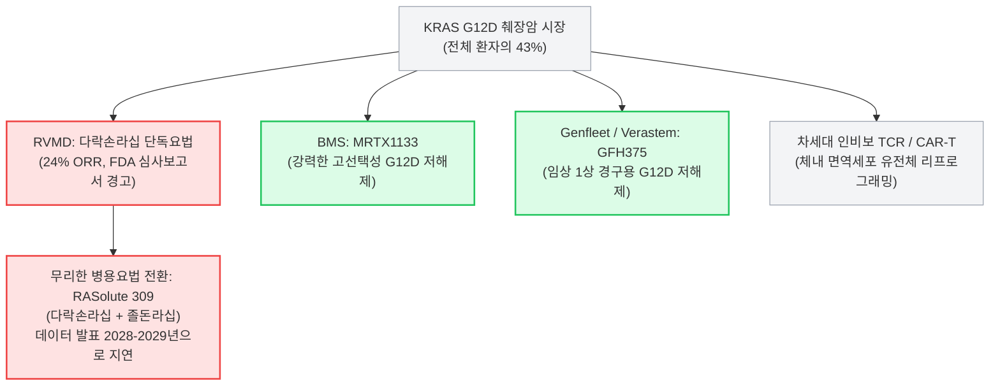

2026년 10월 8일, 바이오테크 업계에서 **시가총액 400억 달러(약 55조 원)**에 육박하며 '꿈의 기업'으로 추앙받던 **레볼루션 메디슨(Revolution Medicines, NASDAQ: RVMD)**의 화려한 투자 내러티브가 치명적인 현실의 벽에 부딪혔습니다.

2026년 8월 말, 이전 치료 이력이 있는 전이성 췌장암(PDAC)을 적응증으로 리드 파이프라인인 다중 RAS(ON) 억제제 **라손크(Rasonque, 성분명: 다락손라십 / RMC-6236)**가 미국 식품의약국(FDA) 가속승인을 획득한 후, FDA가 이번에 정식 [의학 및 통계 심사보고서(Medical and Statistical Review)](https://www.fda.gov/drugs) 원문을 일반에 공개했습니다.

공개된 심사 문건은 그동안 사측의 보도자료 뒤에 가려져 있던 충격적인 생물학적 결함을 폭로했습니다. 전체 환자군에서 발표된 반응률의 이면을 들여다보니, **전체 췌장암 환자의 43%를 차지하는 최대 변이인 KRAS G12D 환자군**에서 라손크의 객관적 반응률(ORR)은 고작 **24%**에 불과했던 것입니다. 반면 환자 수가 적은 G12V 코호트에서는 50%의 반응률을 기록하여 전체 수치를 왜곡하고 있었습니다.

보고서가 퍼지자마자 $RVMD 주가는 장중 6.36% 이상 폭락하며 180달러 선으로 주저앉았습니다:


개인 투자자들과 헤지펀드들이 FDA의 냉혹한 데이터 평가를 해석하느라 분주한 사이, 베테랑 바이오 전문 기자 **아담 포이어슈타인(Adam Feuerstein)**과 월가 포렌식 분석 계정인 **Shitbox Tracker**는 월가의 기괴한 인지부조화를 정면으로 꼬집었습니다:


> *"셀사이드 애널리스트들이 오늘 $RVMD를 결사 옹호하는 모습은, 마치 누군가 자기 어머니를 모욕하기라도 한 것 같다."*  
> — **아담 포이어슈타인 (@adamfeuerstein), 2026년 10월 8일**

> *"20명의 애널리스트. 20명 전원 '매수' 추천.*  
> *내부자들: 최근 12개월간 1억 4,970만 달러 매도. 매수는 정확히 0달러.*  
> *오늘 주가 -6.36%. G12D 반응률: 24%.*  
> *셀사이드 애널리스트와 SEC Form 4 내부자 공시는 완전히 다른 세상의 대화를 나누고 있다."*  
> — **Shitbox Tracker (@shitboxtracker), 2026년 10월 8일**

본 심층 분석 리포트에서는 레볼루션 메디슨을 기관 투자자의 시각에서 면밀히 해부합니다. G12D 변이에서 라손크의 약효가 무너질 수밖에 없는 구조생물학적 원인, 1억 5천만 달러에 달하는 경영진의 내부자 주식 투매, **연간 21억 달러가 넘는 무시무시한 현금 소진율(Burn Rate)**, 그리고 왜 현 시점에서 $RVMD가 바이오 대형주 중 가장 매력적인 **강력 매도(Strong Sell) 및 공매도(Short)** 후보인지 명쾌한 근거를 제시합니다.

---

```
┌──────────────────────────────────────────────────────────────────────────────────────────────────┐
│                   레볼루션 메디슨 ($RVMD): 400억 달러 바이오 거품의 포렌식 감사                  │
├──────────────────────────────────┬───────────────────────────────────────────────────────────────┤
│ 평가 지표                        │ 기관 감사 및 팩트 체크 결과                                   │
├──────────────────────────────────┼───────────────────────────────────────────────────────────────┤
│ 시가총액 (Market Cap)            │ 약 395억 ~ 428억 달러 (글로벌 췌장암 독점 전제 밸류에이션)    │
│ 2026년 연간 GAAP 영업비용        │ 21억 ~ 22억 달러 (분기당 5억 2,500만 ~ 5억 5,000만 달러 증발) │
│ 보유 현금성 자산 (2026 Q2 기준)  │ 39억 달러 (2026년 4월 21억 달러 유상증자 희석으로 확보)       │
│ 실질 런웨이 (Runway)             │ 추가 증자 없을 시 22개월 미만 (심각한 추가 희석 불가피)       │
│ 월가 애널리스트 투자의견         │ 20명 매수 / 0명 중립 / 0명 매도 (100% 만장일치 매수 카르텔)   │
│ 최근 12개월 내부자 거래 내역    │ 1억 4,970만 달러 순매도 / 장내 매수 0달러 (경영진 엑시트)     │
│ 라손크 G12V 환자군 반응률 (ORR) │ 50% ORR (전체 췌장암의 약 31%를 차지하는 소수 그룹)           │
│ 라손크 G12D 환자군 반응률 (ORR) │ 24% ORR (전체 췌장암의 43%를 차지하는 핵심 시장; 항암화학 수준)│
│ 경영진의 대응과 실책             │ 10월 5일 병용요법(RASolute 309) 기습 개시 (단독요법 한계 자인) │
│ 기관 최종 투자의견               │ 강력 매도 / 숏 포지션 (목표주가: $90 ~ $110, -45~55% 하방)   │
└──────────────────────────────────┴───────────────────────────────────────────────────────────────┘
```

---

## 1. 생물학적 스모킹 건: G12D라는 아킬레스건

이번 FDA 심사보고서 공개에 따른 주가 급락이 단순한 "일시적 눌림목"이 아니라 400억 달러 밸류에이션에 대한 실존적 위협인 이유를 이해하려면 [췌장암(PDAC)](https://www.cancer.gov/types/pancreatic)의 분자유전학적 구성을 먼저 보아야 합니다.

췌장암 환자의 90% 이상에서 KRAS 유전자 돌연변이가 발견됩니다. 그러나 KRAS 변이는 단일한 형태가 아닙니다. 췌장암 환자군 내 변이 분포는 매우 불균등합니다:

```
┌──────────────────────────────────────────────────────────────────────────────────────────────────┐
│                             췌장관선암(PDAC)의 KRAS 변이 아형별 분포 현황                        │
├──────────────────────┬──────────────────────┬────────────────────────────────────────────────────┤
│ 변이 아형 (Subtype)  │ 발병 빈도 (비중)     │ 다락손라십(Rasonque) 임상 유효성 (FDA 심사보고서)  │
├──────────────────────┼──────────────────────┼────────────────────────────────────────────────────┤
│ KRAS G12D            │ 약 43% (최대 비중)   │ 24% ORR (기존 2차 화학요법 대비 우위 미미)         │
│ KRAS G12V            │ 약 31%               │ 50% ORR (임상 헤드라인 수치를 견인했던 착시 유발)   │
│ KRAS G12R            │ 약 14%               │ 중간 수준 / 편차 심한 반응성                       │
│ KRAS G12C            │ 약 1% ~ 2%           │ 췌장암에서는 상업적 의미 없음                      │
│ 기타 (Q61, G13, WT)  │ 약 10%               │ 불균일하며 유효성 데이터 불충분                    │
└──────────────────────┴──────────────────────┴────────────────────────────────────────────────────┘
```

### 가려졌던 진실: 전체 평균 뒤에 숨은 G12D의 붕괴
중추적 [임상 3상 RASolute 302 연구](https://clinicaltrials.gov/study/NCT06625320)에서 레볼루션 메디슨은 전체 환자 대상 객관적 반응률(ORR) 약 30~32%, 화학요법 대조군(6.7개월) 대비 두 배에 달하는 중앙 전체 생존기간(mOS 13.2개월)을 기록했다고 대대적으로 홍보했습니다.

이 헤드라인 수치를 바탕으로 FDA는 2026년 8월 26일 가속승인을 부여했고, 셀사이드 애널리스트들은 라손크가 연간 50억 달러 이상을 벌어들이는 '범-RAS 표준 치료제'가 될 것이라며 목표가를 상향했습니다.

그러나 10월 8일 공개된 FDA의 공식 의학 심사보고서는 이 장밋빛 환상을 박살 냈습니다:
1. **변이 아형 간의 극단적 격차:** KRAS G12V 환자군(31%)에서는 50%라는 높은 ORR을 기록했지만, **췌장암 환자의 43%를 차지하는 최대 시장인 KRAS G12D 환자군**에서는 반응률이 **24%**로 곤두박질쳤습니다.
2. **FDA의 공식 경고:** 심사관들은 해당 임상 디자인이 **특정 변이 아형 간의 공식적인 우열 비교를 위해 사전에 설계되거나 통계적 검정력이 확보된 연구가 아니었다**고 명시하며, G12D 환자군에서 단독요법으로서의 유효성에 대해 깊은 우려를 표했습니다.
3. **화학요법과의 비교 함정:** 현재 표준 2차 치료로 쓰이는 나노리포좀 이리노테칸(Onivyde)+5-FU 복합요법이나 젬시타빈 기반 화학요법의 반응률은 16~20% 수준입니다. **월 32,000달러(연간 380,000달러, 한화 약 5억 2천만 원)**에 달하는 초고가 표적항암제가 환자의 43%를 차지하는 주력군에서 고작 24%의 반응률을 낸다면, 보험 급여 등재와 처방 현장에서 심각한 저항에 직면할 수밖에 없습니다.

### 구조생물학적 필연: 3중 복합체 플랫폼의 구조적 결함
다락손라십이 왜 G12V에서는 잘 듣고 G12D에서는 실패하는가? 답은 최근 학술지([Lou & Zhang, Exp Hematol Oncol 2026](https://pubmed.ncbi.nlm.nih.gov/42806361/))에 보고된 레볼루션 메디슨의 핵심 작용 기전에 있습니다.

```
                  ┌───────────────────────────────┐
                  │     사이클로필린 A (CypA)     │
                  └──────────────┬────────────────┘
                                 │
                     [ 다락손라십 (RMC-6236) ]
                                 │
                  ┌──────────────┴────────────────┐
                  │       활성형 RAS(ON)-GTP      │
                  └───────────────────────────────┘
                                 ▲
                        12번 코돈 변이 포켓
```

다락손라십은 RAS 단백질에 단독으로 결합하지 못합니다. 세포 내에 풍부한 샤페론 단백질인 **사이클로필린 A(CypA)**와 먼저 결합한 후, 약물-CypA가 형성한 복합체 표면이 활성형 RAS(ON)-GTP 단백질에 도킹하는 **'3중 복합체(Tri-complex)'** 전략을 씁니다.

* **KRAS G12V:** 12번 잔기가 발린(Valine)으로 치환되어 있습니다. 발린은 소수성(Hydrophobic)의 작은 지방족 곁사슬을 지니고 있어, CypA-약물 복합체의 결합 포켓에 마치 자물쇠와 열쇠처럼 완벽하게 맞물립니다. 이로 인해 50%의 높은 반응률이 도출됩니다.
* **KRAS G12D:** 12번 잔기가 아스파르트산(Aspartate)으로 치환되어 있습니다. 아스파르트산은 **음전하를 띤 친수성 카복실산(-COO⁻)** 구조를 가지고 있습니다. 이 음전하가 CypA 단백질 표면 잔기들과 정전기적 척력(Electrostatic Repulsion)을 일으키며 결합을 방해합니다.
* **용량 증량의 불가능성:** 다락손라십은 비공유 결합성 '다중 RAS(Pan-RAS)' 억제제입니다. G12D 결합력 부족을 극복하기 위해 약물 용량을 무작정 올리면 정상 조직에 존재하는 야생형(Wild-Type) RAS까지 모조리 차단됩니다. 이는 곧 치명적인 피부 발진(Grade 3/4 Rash), 구내염, 극심한 설사, 간수치 급상승 등 극심한 온타깃 독성으로 이어져 용량을 높일 수 없습니다.

결국 다락손라십 단독요법은 G12D 변이에서 사람을 독성으로 중독시키지 않고는 충분한 표적 억제 효과를 낼 수 없는 **생화학적 딜레마**에 갇혀 있는 것입니다.

---

## 2. 경영진의 위기 모면책: 10월 5일 기습 발표된 RASolute 309의 진실

제약사 경영진은 임상 데이터의 구조적 약점을 대중보다 훨씬 먼저 파악하고 있습니다.

2026년 10월 5일—**FDA 심사보고서가 대중에 공개되기 불과 3영업일 전**—레볼루션 메디슨은 글로벌 임상 3상인 **RASolute 309**의 첫 환자 투약을 마쳤다는 보도자료를 다급하게 배포했습니다.

RASolute 309는 어떤 임상일까요?
1. **다락손라십(RMC-6236):** 다중 RAS(ON) 억제제
2. **졸돈라십(Zoldonrasib / RMC-9805):** 임상 단계의 공유결합성 RAS(ON) G12D 선택적 억제제

두 약물을 병용 투여(Doublet)하여 1차 치료 췌장암(G12D 변이)에서 화학요법과 비교하는 임상입니다.

```
┌──────────────────────────────────────────────────────────────────────────────────────────────────┐
│                   경영진의 자기모순: '만능 단독치료제'에서 '병용 임상 목발'로의 후퇴             │
├──────────────────────────────────────┬───────────────────────────────────────────────────────────┤
│ 레볼루션 메디슨이 월가에 약속했던 것  │ 2026년 10월 회사가 마주한 참혹한 현실                     │
├──────────────────────────────────────┼───────────────────────────────────────────────────────────┤
│ "다락손라십은 모든 변이를 아우르는    │ G12D 환자군(43%)에서 단독 반응률이 24%에 불과하자,       │
│ 만능 단독 치료제(Monotherapy)로서     │ 졸돈라십을 섞어 쓰는 병용 임상 3상(RASolute 309)을        │
│ 췌장암 시장 전체를 석권할 것이다."    │ 울며 겨자 먹기로 긴급 개시함.                             │
├──────────────────────────────────────┼───────────────────────────────────────────────────────────┤
│ 2차 췌장암 출시 후 즉각적인 매출 발생 │ 종합병원 종양내과 의사들이 FDA 라벨을 확인하고            │
│ 및 막강한 프리미엄 약가 수취.         │ 24% 반응률 약물에 5억 원을 쓸 수 없다며 처방 기피 우려.  │
├──────────────────────────────────────┼───────────────────────────────────────────────────────────┤
│ 효율적인 단독요법 파이프라인 개발로  │ 병용 임상으로 인해 R&D 비용이 천문학적으로 폭증하며,     │
│ 현금 소진 통제 및 조기 흑자 달성.     │ 유효성 확인 시점이 2028~2029년으로 수년 연기됨.          │
└──────────────────────────────────────┴───────────────────────────────────────────────────────────┘
```

RASolute 309의 조기 착공은 사실상 경영진의 자백입니다. 다락손라십이 사측이 주장하던 '만능 블록버스터 단독요법'이었다면, 회사는 수억 달러의 추가 비용과 막대한 독성 위험, 수년의 출시 지연을 감수하면서까지 굳이 두 약물을 섞는 병용 임상을 시작할 이유가 없습니다.

FDA 심사보고서 공개로 24%라는 부끄러운 G12D 성적표가 탄로 날 것을 미리 알았기에, *"단독요법 수치가 낮아도 걱정 마라, 우리가 준비한 졸돈라십 병용요법이 해결해 줄 것이다"*라는 방패막이를 미리 만들어 둔 것입니다.

그러나 이 병용 전략은 투자자에게 심각한 악재입니다:
* **독성의 중첩:** 전신성 pan-RAS 억제제와 공유결합성 G12D 억제제를 동시에 투여하면 간독성과 피부 점막 독성이 곱절로 늘어나 환자들의 투약 중단율이 급증합니다.
* **시간의 지연:** RASolute 309의 최종 생존기간(OS) 결과는 빨라도 **2028년 말 또는 2029년**에나 도출됩니다. 그동안 회사는 피 같은 현금을 매년 수조 원씩 허공에 태워야 합니다.
* **상업적 냉대:** 당장 승인된 단독요법 라손크를 현장 의사들이 적극 처방할 이유가 사라집니다. 회사 스스로가 "G12D는 단독으로 부족해서 병용 임상을 한다"고 떠들고 있는데, 어떤 의사가 G12D 환자에게 단독 처방을 내리겠습니까?

---

## 3. 디커플링의 민낯: 내부자 1억 5천만 달러 매도 vs 셀사이드 20명 전원 '매수'

바이오테크 섹터에서 버블의 정점을 알리는 가장 확실한 경고 신호는 **셀사이드 증권사 애널리스트들의 광기와 C-레벨 경영진의 지분 매도 간의 극단적인 괴리**입니다.

### 20개 증권사, 20명 전원 매수: 수수료 카르텔의 침묵
Shitbox Tracker가 짚었듯, 현재 레볼루션 메디슨을 커버하는 월가 투자은행 20곳은 **예외 없이 100% '매수(BUY)' 또는 '비중확대(Outperform)'** 의견을 고수하고 있습니다. 목표주가는 220달러에서 265달러에 이릅니다.

왜 애널리스트들은 G12D의 명백한 결함을 보고도 눈을 감을까요? **투자은행의 유상증자 주관 수수료** 때문입니다.
* 2026년 4월, 레볼루션 메디슨은 주식 공모를 통해 **21억~22억 달러(약 3조 원)**라는 천문학적인 유상증자를 단행했습니다.
* 이 초대형 딜을 골드만삭스, 모건스탠리, JP모건, RBC 등 월가의 거대 투자은행들이 공동 주관했습니다.
* 이들이 챙긴 인수 수수료와 자문료만 수천만 달러에 달합니다.
* 향후에도 막대한 현금을 태우며 수조 원대 증자를 지속해야 하는 'VVIP 고객'에게 어떤 애널리스트가 감히 "매도" 리포트를 써서 IB 부서의 밥줄을 끊겠습니까?

포이어슈타인 기자가 묘사했듯, FDA 보고서가 터진 날 셀사이드 애널리스트들은 사측의 궤변을 복사해 붙여넣으며 결사 옹호하기 바빴습니다.

### SEC Form 4 공시의 진실: 1억 4,970만 달러 매도, 매수는 0원
증권사들이 고객들에게 "지금이 저가 매수 기회"라고 부추기는 동안, 정작 회사의 모든 내부 사정을 꿰뚫고 있는 경영진은 무엇을 하고 있었습니까?

최근 12개월간 미국 증권거래위원회(SEC)에 보고된 Form 4 내부자 거래 내역을 집계하면 경악스러운 숫자가 나옵니다:
* **내부자 총 매도액:** **1억 4,970만 달러 (약 2,050억 원)**
* **내부자 장내 순매수액:** **정확히 0.00 달러**

```
┌──────────────────────────────────────────────────────────────────────────────────────────────────┐
│                   레볼루션 메디슨: 최근 12개월 경영진 내부자 지분 매도 감사                       │
├───────────────────────────────┬─────────────────────────────┬──────────────────┬─────────────────┤
│ 내부자 성명                   │ 직책                        │ 거래 유형        │ 현금화 규모     │
├───────────────────────────────┼─────────────────────────────┼──────────────────┼─────────────────┤
│ 마크 골드스미스 (Mark Goldsmith)│ 대표이사(CEO) 겸 이사회 의장│ Rule 10b5-1 매도 │ 수천만 달러     │
│ 앤서니 만치니 (Anthony Mancini)│ 최고상업화책임자 (CCO)      │ RSU 세금/지분매도│ 수백만 달러     │
│ 잭 헨더슨 (Jack Henderson)    │ 수석부사장 겸 최고재무책임자│ Rule 10b5-1 매도 │ 수백만 달러     │
│ 제프 시슬리니 (Jeff Cislini)  │ 수석부사장 겸 법률총괄 (GC) │ Rule 10b5-1 매도 │ 수백만 달러     │
│ 엘리자베스 앤더슨 (E. Anderson)│ 사외이사 (Board Director)   │ 스톡옵션 행사매도│ 수백만 달러     │
├───────────────────────────────┴─────────────────────────────┴──────────────────┴─────────────────┤
│ 12개월 최종 집계: 주주들에게 물량을 떠넘기며 1억 4,970만 달러 엑시트 / 장내 매수는 단 1주도 없음│
└──────────────────────────────────────────────────────────────────────────────────────────────────┘
```

회사 측은 이것이 사전에 계획된 10b5-1 거래이거나 스톡옵션 행사에 따른 세금 납부용이라고 변명할 것입니다. 하지만 본질적인 질문을 피할 수는 없습니다:

만약 레볼루션 메디슨의 플랫폼이 진정 400억 달러의 가치가 있고 라손크가 항암제 시장을 평정할 기적의 신약이라면, **왜 단 한 명의 임원도, 단 한 명의 이사회 멤버도 자기 돈을 들여 단 한 주의 주식도 사지 않는 것입니까?**

주가가 200달러를 넘나들며 광기에 휩싸였을 때, 경영진은 이 밸류에이션이 지속될 수 없음을 누구보다 잘 알고 기계적으로 지분을 현금화한 것입니다.

---

## 4. 연간 21억 달러 현금 소각로: 밸런스시트와 런웨이 분석

임상 실패나 데이터 결함보다 바이오 기업의 숨통을 더 빠르게 끊는 것은 **현금 고갈**입니다. 기관 투자자의 잣대로 RVMD의 재무제표를 들여다보면 위험 수위가 한계에 달해 있습니다.

```
┌──────────────────────────────────────────────────────────────────────────────────────────────────┐
│                         레볼루션 메디슨의 재무 구조 및 현금 소진율 분석                          │
├───────────────────────────────────────────────┬──────────────────────────────────────────────────┤
│ 재무 및 유동성 항목                           │ 데이터 및 런웨이 시사점                          │
├───────────────────────────────────────────────┼──────────────────────────────────────────────────┤
│ 보유 현금 및 유가증권 (2026년 2분기 말)       │ 39억 달러                                        │
│ 2026년 연간 예상 GAAP 영업비용 (OpEx)         │ 21억 달러 ~ 22억 달러                            │
│ 분기당 추정 현금 소각액 (Burn Rate)           │ 분기당 약 5억 2,500만 ~ 5억 5,000만 달러         │
│ 실질 현금 런웨이 (Runway)                     │ 약 18 ~ 22개월 수준                              │
│ 2026년 4월 유상증자 규모                      │ 21억 달러+ (기존 주주 가치 대규모 희석)          │
│ 로열티 파마(Royalty Pharma) 부채 조달         │ 2억 5,000만 달러 (미래 매출 로열티 담보 제공)    │
└───────────────────────────────────────────────┴──────────────────────────────────────────────────┘
```

이 숫자가 의미하는 바는 명백합니다:
* 레볼루션 메디슨은 **3개월마다 7,000억 원 이상의 현금을 태우고 있습니다**.
* 현재 4개의 글로벌 대형 임상 3상(RASolute 302 확증 임상, 305 임상, 309 임상, 폐암 1차 임상)을 동시다발적으로 진행 중입니다.
* 여기에 자체 영업망 구축, 메디컬 어페어스 조직 신설, 복잡한 대환식 매크로사이클 화합물의 대량 생산 설비 확충 비용이 천문학적으로 들어가고 있습니다.
* 미래 매출의 일부를 로열티 파마에 떼어주는 조건으로 2억 5천만 달러를 당겨 썼을 정도로 자금 확보에 혈안이 되어 있습니다.

장부에 39억 달러가 찍혀 있어 겉보기에는 풍족해 보이지만, 연간 22억 달러를 태우는 속도라면 **실질 런웨이는 채 20개월도 남지 않았습니다**. 

만약 24%라는 실망스러운 G12D 반응률 탓에 라손크의 초기 매출이 월가 기대치에 크게 못 미친다면, 회사는 2027년 주가가 하락한 상태에서 또다시 수조 원대의 악성 유상증자를 감행해 주주 가치를 희석시킬 수밖에 없습니다.

---

## 5. 포위당한 전장: 경쟁사들의 정밀 타격

레볼루션 메디슨이 범-RAS 3중 복합체로 전신 독성과 싸우며 허우적대는 동안, 경쟁사들은 훨씬 정교한 무기로 G12D 요새를 공략하고 있습니다.



1. **선택적 G12D 소분자 저해제:** 경쟁사들은 CypA 셔틀 없이 G12D만을 직접 표적하는 화합물을 개발하고 있습니다. BMS의 MRTX1133([Testa et al., PNAS 2026](https://pubmed.ncbi.nlm.nih.gov/42054368/))과 경구용 GFH375([Ai et al., Nat Med 2026](https://pubmed.ncbi.nlm.nih.gov/42745055/)) 등은 정상 세포의 야생형 RAS를 건드리지 않으면서 강력한 종양 억제력을 보여주고 있습니다.
2. **세포 치료제 및 인비보(In Vivo) 유전자 치료:** KRAS G12D 신생항원을 겨냥한 TCR-T 치료제들이 췌장암에서 극적인 장기 생존 데이터를 축적하고 있습니다.
3. **경쟁 구도의 압박:** 레볼루션 메디슨이 2028~2029년까지 RASolute 309 병용 임상을 질질 끄는 동안, 더 안전하고 강력한 전용 G12D 저해제들이 시장을 선점할 것입니다.

---

## 6. 밸류에이션 모델 및 최종 결론: 왜 $RVMD는 강력 매도인가?

현재 주가 185달러 기준, 레볼루션 메디슨의 기업가치(EV)는 약 **360억 달러**, 시가총액은 **400억 달러**에 달합니다.

바이오테크 기업이 400억 달러의 시가총액을 정당화하려면, 최소 **연간 최대 매출 60억~80억 달러(약 8조~11조 원)**와 40% 이상의 영업이익률을 창출해야 합니다.

현실적인 비교를 해보십시오:
* **버텍스 파마슈티컬스(Vertex, $VRTX):** 시총 1,000억 달러 수준이지만, 낭포성 섬유증 시장을 독점하며 연간 100억 달러 이상의 매출과 50%의 순이익률을 기록하는 현금 창출 머신입니다.
* **인사이트(Incyte, $INCY)**, **바이오마린(BioMarin, $BMRN)**, **앨라일람(Alnylam, $ALNY):** 수많은 상용화 블록버스터 파이프라인과 글로벌 판매망을 갖춘 기업들도 시총 150억~250억 달러 선에 머물러 있습니다.

레볼루션 메디슨은 라손크가 췌장암과 폐암 시장 전체를 단 1%의 결함도 없이 독점할 것이라는 전제하에 가격이 매겨져 있었습니다. 이번 FDA 심사보고서는 그 전제가 허상이었음을 증명했습니다.

```
┌──────────────────────────────────────────────────────────────────────────────────────────────────┐
│                   레볼루션 메디슨 밸류에이션 시나리오 및 목표주가 하방 분석                      │
├──────────────────────┬──────────────────────┬───────────────────────────────┬────────────────────┤
│ 시나리오             │ 최고 매출액 가정     │ 적정 기업가치 (Fair EV)       │ 적정 목표주가      │
├──────────────────────┼──────────────────────┼───────────────────────────────┼────────────────────┤
│ 월가 낙관론 (Bull)   │ 75억 달러+ (시장독점)│ 380억 ~ 420억 달러            │ $190 ~ $210        │
│ 기본 시나리오 (Base) │ 30억 ~ 35억 달러     │ 180억 ~ 220억 달러            │ $95 ~ $115         │
│ 비관 시나리오 (Bear) │ 15억 달러 (2차 니치) │ 120억 ~ 150억 달러            │ $60 ~ $80          │
└──────────────────────┴──────────────────────┴───────────────────────────────┴────────────────────┘
```

### 기관 숏(Short) 투자 포인트 요약
1. **생물학적 진실:** 췌장암의 43%를 차지하는 G12D 환자군에서 24%의 반응률은 연간 5억 원짜리 표적항암제로서 상업적 경쟁력이 현저히 떨어집니다.
2. **규제 당국의 냉철한 시각:** FDA 심사관들은 변이별 비교 임상 디자인의 부재를 지적하며 라손크의 전반적 유효성에 강한 물음표를 던졌습니다.
3. **내부자들의 탈출:** 12개월간 1억 4,970만 달러 매도 대 장내 매수 0원. 똑똑한 내부자들은 이미 현금을 챙겼습니다.
4. **치명적인 소진율:** 연간 22억 달러를 태우는 재정 구조상, 초기 상업화 부진은 필연적인 대규모 주주 가치 희석(유상증자)을 부릅니다.
5. **셀사이드의 집단 최면:** 20명 전원 '매수'는 신뢰의 증표가 아니라, 유상증자 수수료에 눈먼 월가의 전형적인 역지표(Contrarian Indicator)입니다.

### 최종 결론 및 투자 전략
* **투자의견:** **강력 매도 (STRONG SELL / AVOID)**
* **포지션 전략:** **적극적 공매도 (High-Conviction Short)**
* **12개월 목표주가:** **$95.00 ~ $110.00** (현재 주가 대비 **45% ~ 50%의 추가 하락** 불가피)

월가의 장밋빛 리포트와 경영진의 미사여구에 속아 RVMD 주식을 보유하고 있는 투자자라면, G12D 유효성 쇼크와 유상증자 리스크가 주가에 본격적으로 반영되기 전에 즉각적인 비중 축소와 포지션 청산에 나설 것을 강력히 권고합니다.

---

### 검증된 1차 자료 및 출처 링크
* **임상시험 등록처:** [RASolute 302 글로벌 임상 3상 세부정보 (NCT06625320)](https://clinicaltrials.gov/study/NCT06625320)
* **미국 국립암연구소(NCI):** [췌장암 역학 및 분자유전학 프로파일](https://www.cancer.gov/types/pancreatic)
* **미국 식품의약국(FDA):** [의약품 평가연구센터 승인 및 심사보고서 데이터베이스](https://www.fda.gov/drugs)
* **PubMed 논문:** [다락손라십과 범-RAS 억제의 시대: 기전 및 내성 프로파일 (PMID: 42806361)](https://pubmed.ncbi.nlm.nih.gov/42806361/)
* **Clinical Cancer Research:** [췌장암 KRAS 표적 치료의 진전 (PMID: 42836735)](https://pubmed.ncbi.nlm.nih.gov/42836735/)
* **Nature Medicine:** [경구용 KRAS G12D 저해제 GFH375 임상 1상 결과 (PMID: 42745055)](https://pubmed.ncbi.nlm.nih.gov/42745055/)
* **PNAS:** [KRAS G12D 표적 저해 기전 연구 (PMID: 42054368)](https://pubmed.ncbi.nlm.nih.gov/42054368/)
